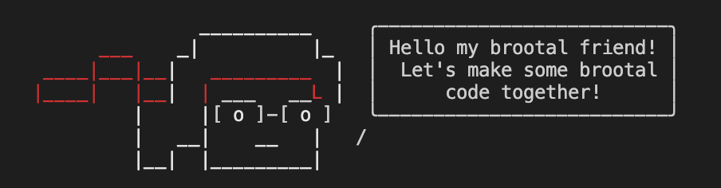

# brosay

> Tell Bro (Brootal CLI guy) what to say

Like [cowsay](https://en.wikipedia.org/wiki/Cowsay), but less cow.
Based on Yosay from Yeoman (love you guys)




## Install

```
$ npm install brosay
```


## Usage

```js
const brosay = require('brosay');

console.log(brosay('Hello my brootal friend! Let\'s make some brootal code together!'));

/*
                __________     ╭──────────────────────────╮
       ___    _|          |_   │ Hello my brootal friend! │
  ____|___|__|   _________  |  │  Let's make some brootal │
 |____|   |__|  | ___   __L |  │      code together!      │
          |     |[ o ]-[ o ]   ╰──────────────────────────╯
          |   __|    __   |   /
          |__|  |_________|    
 */
```

*You can style your text with [`chalk`](https://github.com/sindresorhus/chalk) before passing it to `brosay`.*


## CLI

```
$ npm install --global brosay
```

```
$ brosay --help

  Usage
    $ brosay <string>
    $ brosay <string> --maxLength 8
    $ echo <string> | yosay

  Example
    $ brosay 'I love pony and pain!'

                __________     
       ___    _|          |_   
  ____|___|__|   _________  |  ╭──────────────────────────╮
 |____|   |__|  | ___   __L |  │   I love pony and pain!  │
          |     |[ o ]-[ o ]   ╰──────────────────────────╯
          |   __|    __   |   /
          |__|  |_________|    


## License

BSD-2-Clause © Google
